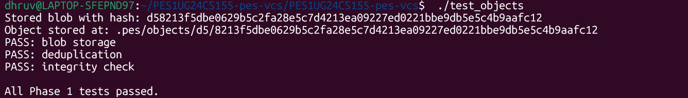
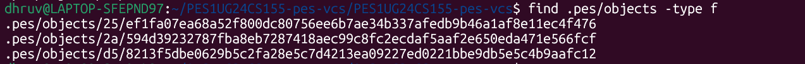
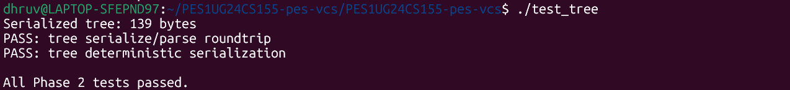
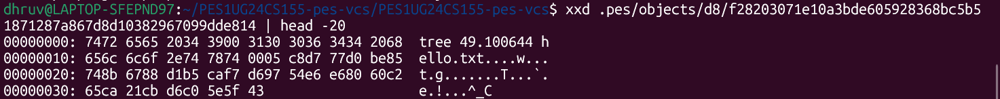
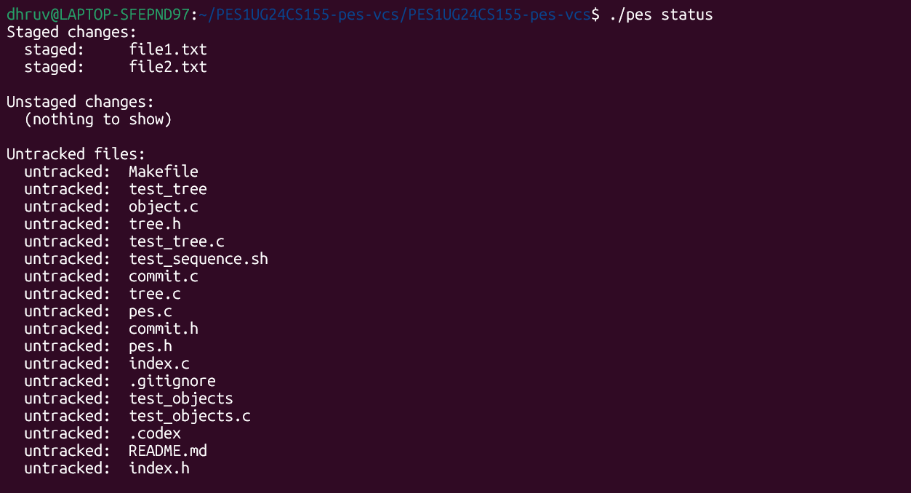
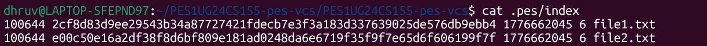
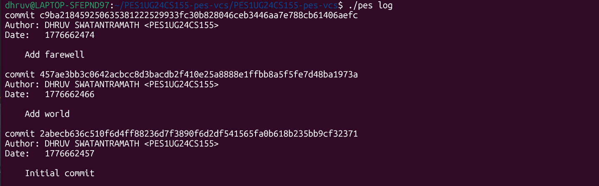
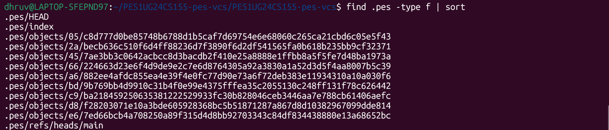
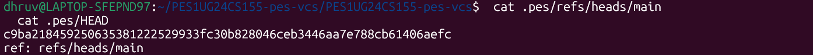

# PES-VCS Lab Report

**Student Name:** Dhruv Swatantramath  
**SRN:** PES1UG24CS155  
**Repository:** PES1UG24CS155-pes-vcs

---

## Screenshot 1A

`./test_objects` output showing all tests passing.

## Screenshot 1B

`find .pes/objects -type f` showing the sharded object directory structure.

## Screenshot 2A

`./test_tree` output showing all tests passing.

## Screenshot 2B

`xxd` output of a raw tree object.

## Screenshot 3A

`./pes init`, `./pes add`, and `./pes status` sequence.

## Screenshot 3B

`cat .pes/index` showing the text-format index.

## Screenshot 4A

`./pes log` output showing commit history.

## Screenshot 4B

`find .pes -type f | sort` showing repository object growth.

## Screenshot 4C

`cat .pes/refs/heads/main` and `cat .pes/HEAD` showing the reference chain.

## Final Integration Test

### Final Integration Test 1

### Final Integration Test 2

### Final Integration Test 3

---

## Analysis Answers

### Q5.1 Branching and Checkout

A branch in PES-VCS can be implemented as a plain file under `.pes/refs/heads/` containing a commit hash. To implement `pes checkout <branch>`, PES-VCS would first verify that `.pes/refs/heads/<branch>` exists and read the target commit hash from it. Then `.pes/HEAD` should be updated to contain `ref: refs/heads/<branch>`, so HEAD symbolically points to the selected branch.

After updating the reference, PES-VCS must update the working directory to match the tree stored in the target commit. That means reading the target commit object, following its root tree hash, recursively walking all tree entries, restoring files from blob objects, creating directories where needed, and removing files that exist in the current checkout but not in the target tree. File permissions such as executable bits must also be restored. The complexity comes from the fact that checkout is not just changing metadata in `.pes/`; it must safely rewrite the user's actual files on disk without losing local work.

### Q5.2 Dirty Working Directory Conflict Detection

To detect a dirty working directory conflict using only the index and object store, PES-VCS would compare the working copy of each tracked file against the corresponding index entry. The index stores the staged hash, size, and modification time. By calling `stat()` on the working file, PES-VCS can detect whether the working version differs from the version represented in the index. A different `mtime` or `size` indicates that the file has been modified or deleted since it was last staged.

When checking out another branch, PES-VCS must also compare the current staged version with the version stored in the target branch's tree. If the target branch has a different blob hash for the same path, and the working directory file is already dirty relative to the index, switching branches would overwrite uncommitted local changes. In that case checkout must refuse. The same rule applies when one branch deletes a file and the other keeps it, or when a file exists only on one side.

### Q5.3 Detached HEAD

Detached HEAD means `.pes/HEAD` contains a commit hash directly instead of a symbolic reference like `ref: refs/heads/main`. If the user creates commits in this state, PES-VCS will still create valid commit objects with parent links, but no branch name will move to point at those commits. Only HEAD will point to them directly.

These commits can become unreachable if the user later checks out a normal branch, because HEAD will then move away and no branch file will preserve the detached commits. Recovery is still possible if the commit hash is known. The user can create a new branch by writing that commit hash into a new file under `.pes/refs/heads/`, which makes the detached history reachable again. In real Git this is often recovered through the reflog; in PES-VCS, recovery depends on retaining or rediscovering the commit hash before garbage collection deletes it.

### Q6.1 Garbage Collection and Reachability

Garbage collection for PES-VCS can be implemented using a mark-and-sweep algorithm. In the mark phase, PES-VCS begins from every live reference, such as each branch file inside `.pes/refs/heads/` and possibly `.pes/HEAD` if it stores a direct commit hash. Starting from each referenced commit, PES-VCS recursively visits the commit object, its tree object, every subtree reachable from that tree, every blob reachable from those trees, and each parent commit in history. Every visited hash is inserted into a set of reachable objects.

In the sweep phase, PES-VCS scans all files under `.pes/objects/`, reconstructs each object hash from its shard directory and filename, and checks whether that hash appears in the reachable set. If not, that object is unreachable and may be deleted.

The best data structure for tracking reachability is a hash set, because it provides fast insertion and membership checks while traversing a potentially large object graph. For a repository with 100,000 commits and 50 branches, the number of visited objects depends on overlap between histories, but in the worst realistic case PES-VCS may need to visit all reachable commits plus their associated trees and blobs. That can easily be several hundred thousand objects and, in repositories with many unique snapshots, could grow into the millions.

### Q6.2 GC Race Condition with Concurrent Commits

Running garbage collection concurrently with commit creation is dangerous because a new commit is created in stages. First blob and tree objects may be written. Then the commit object is written. Only at the end is the branch reference updated to make the new commit reachable. If GC scans the references during this window, it will not yet see the newly written objects as reachable from any branch.

One race condition is: the commit path writes a new tree object; before the new commit and branch update are completed, GC scans all current references, concludes that the new tree is unreachable, and deletes it. Then commit creation finishes and stores a commit that points to a tree object that no longer exists. The repository is now inconsistent.

Git avoids this by being conservative about deleting objects, coordinating reference updates carefully, and protecting objects that may be part of an in-progress operation. The core rule is that GC must not delete objects that are only temporarily unreferenced due to an active commit operation.
